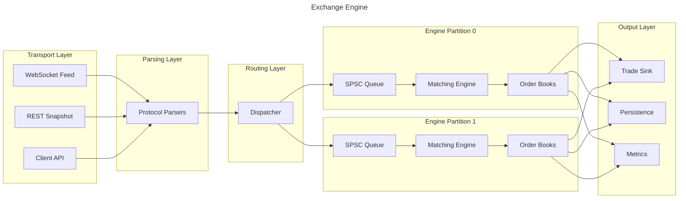
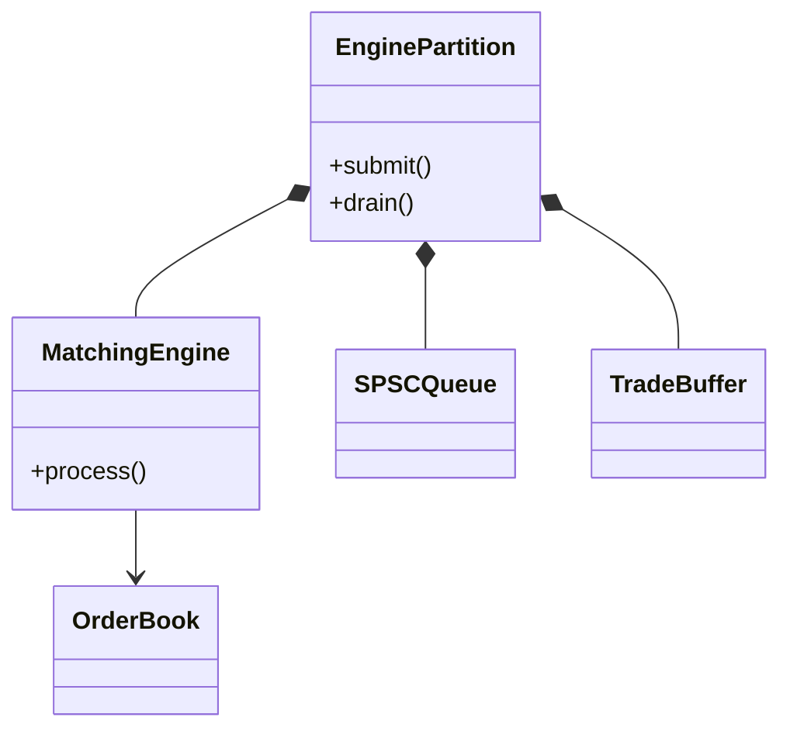

# Exchange Engine

<div align="center">

**A high-performance electronic exchange engine implemented in modern C++23.**


</div>
---
## Overview

The project models the complete
execution pipeline—from receiving market data and client commands, through
routing and matching, to trade generation and persistence.

The architecture emphasizes deterministic execution by assigning exclusive
ownership of each order book to a single engine thread. Communication between
threads occurs exclusively through lock-free message passing, eliminating locks
from the matching path while preserving correctness.


The implementation emphasizes:

* **Price-time priority** (FIFO at each price level)
* **Single-threaded matching** for deterministic execution
* **Event-driven architecture**
* **Lock-free communication between threads**
* **Zero dynamic allocation on the hot path**
* **Cache-friendly data structures**
* **Modern C++23 design**

---

# Features

### Matching Engine

* Price-time priority (FIFO)
* Limit order matching
* Order cancellation
* Partial fills
* Multiple executions per incoming order
* Batched trade generation
* Deterministic execution

### Matching Engine

- Price-time priority
- FIFO execution
- Partial fills
- Multiple executions
- Order cancellation
- Future support for iceberg, stop and market orders

### Order Book

* Separate bid and ask books
* Sorted contiguous price levels
* Intrusive FIFO order queues
* O(1) cancellation
* O(log n) price lookup
* Object pool backed storage
* No heap allocation during matching

### Concurrency

* Lock-free bounded SPSC queue
* Wait-free producer
* Wait-free consumer
* Acquire/Release memory ordering
* False-sharing avoidance
* Cache-line aligned control variables

### Market Data

* Binance REST snapshot parsing
* Binance WebSocket depth updates
* Integer-scaled prices
* Snapshot reconstruction
* L2 order book support

### Performance

* Branchless binary search
* Intrusive linked lists
* Cache-aware object pool
* Batch command processing
* Zero-copy command transport
* Minimal branch misprediction

---

# Project Goals

This project explores how a modern electronic exchange engine can be implemented while maintaining:

* predictable latency
* deterministic behavior
* cache efficiency
* modular architecture
* clear separation of responsibilities

The primary goal is **software architecture**, not exchange completeness.

Consequently, each subsystem is intentionally isolated and independently testable.

---

# High-Level Architecture



The architecture is divided into six logical layers:

| Layer         | Responsibility                                                  |
| ------------- | --------------------------------------------------------------- |
| **Transport** | Receives orders and market data from external sources.          |
| **Parsing**   | Converts protocol messages into internal command objects.       |
| **Routing**   | Assigns commands to engine partitions based on ownership rules. |
| **Execution** | Executes commands and performs order matching.                  |
| **Storage**   | Maintains order books and resting liquidity.                    |
| **Output**    | Publishes trades, persistence events and statistics.            |

Each layer communicates only with its neighboring layers, reducing coupling and making components independently testable.

---

# Threading Model

The system intentionally keeps the matching engine **single-threaded**.


Each engine partition owns one or more order books exclusively.

This ownership model eliminates contention inside the matching engine and
confines concurrency to message passing between threads.
This eliminates the need for:

* mutexes
* reader/writer locks
* hazard pointers
* lock-free trees
* concurrent skip lists

Instead, concurrency is isolated entirely to message passing via the lock-free queue.

This separation significantly simplifies correctness while maintaining high throughput.

---

# Engine Partition

Each engine partition owns everything required to process a subset of instruments.



An engine partition provides:

* one command queue
* one consumer thread
* one matching engine
* one reusable trade buffer
* one or more order books

Symbols are assigned to partitions by the dispatcher.

Future versions may support multiple partitions without modifying the matching algorithm.

---

# Design Principles

## Event Driven

The matching engine never waits for incoming requests.

Commands are pushed into a bounded queue and processed asynchronously.

---

## Deterministic

For identical command streams, execution order is always identical.

---

## Cache Friendly

The project favors contiguous memory whenever practical.

Examples include:

* sorted vectors
* object pools
* intrusive lists
* reusable buffers

---

## Lock Free

Locks are used only where unavoidable.

The hot path contains:

* no mutexes
* no condition variables
* no blocking synchronization

---


# Documentation

Comprehensive documentation is available under the **docs/** directory.

| Document              | Description                         |
| --------------------- | ----------------------------------- |
| `architecture.md`     | Complete system architecture        |
| `directory-layout.md` | Source tree overview                |
| `matching-engine.md`  | Matching pipeline                   |
| `concurrency.md`      | Lock-free queue and threading model |
| `memory.md`           | Object pool and allocation strategy |
| `market-data.md`      | Binance integration                 |
| `events.md`           | Command and event model             |
| `persistence.md`      | Journaling and snapshots            |
| `performance.md`      | Optimization techniques             |
| `benchmarks.md`       | Benchmark methodology               |
| `api.md`              | Public API                          |
| `design-decisions.md` | Architectural trade-offs            |

---

# Project Structure

```text
src/
├── core/
├── transport/
├── market_data/
├── engine/
├── orderbook/
├── event/
├── concurrency/
├── memory/
├── persistence/
├── strategy/
├── util/
└── benchmark/
```

A detailed explanation of every module is available in **docs/directory-layout.md**.

---

# Build
// TODO

---

# Roadmap

```text
Exchange
├── Engine partitioning
├── NUMA scheduling
├── Symbol routing

Matching
├── Iceberg
├── Stop
├── Market
├── IOC/FOK

Infrastructure
├── FIX gateway
├── Persistence
├── Replay
├── Event sourcing

Performance
├── SIMD
├── Huge pages
├── Lock-free dispatcher

Analytics
├── Latency profiler
├── Metrics
├── Benchmark suite
```
---