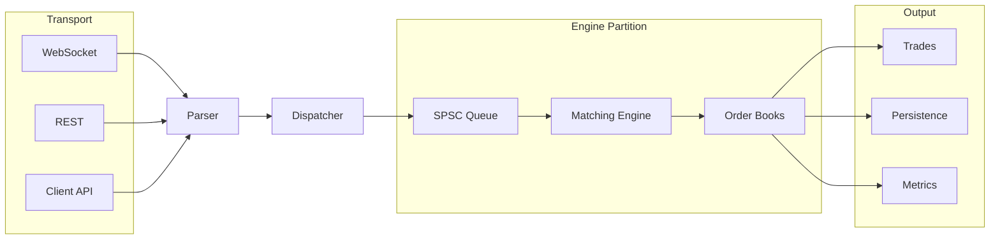

# Exchange Engine

**A high-frequency trading framework in modern C++23.**

---

## Overview

The engine models the full execution pipeline: receiving market data and client
commands, routing them, matching, and emitting trades.

Determinism comes from ownership rather than locking — each order book is owned
exclusively by a single engine thread, and threads communicate only through
lock-free message passing. This keeps locks off the matching path while
preserving correctness.

The goal of this project is **software architecture**, not exchange
completeness; each subsystem is isolated and independently testable.

## Features

**Matching** — price-time priority (FIFO per level), limit orders, partial
fills, multiple executions per incoming order, cancellation, batched trade
generation. Iceberg / stop / market orders are planned.

**Order book** — separate bid/ask books over sorted contiguous price levels,
intrusive FIFO queues, O(1) cancel, O(log n) price lookup, object-pool storage,
no heap allocation while matching.

**Concurrency** — lock-free bounded SPSC queue, wait-free producer and consumer,
acquire/release ordering, cache-line-aligned control variables to avoid false
sharing.

**Market data** — Binance REST snapshots and WebSocket depth updates,
integer-scaled prices, L2 book reconstruction.

**Performance** — branchless binary search, intrusive lists, cache-aware object
pool, batch command processing, zero-copy command transport.

## Architecture

Commands flow through fixed layers, each depending only on its neighbor. Only
the execution layer mutates market state. See
[docs/architecture.md](docs/architecture.md) for the execution model and
[docs/directory_layout.md](docs/directory_layout.md) for the source tree.

## Build

_TODO_

## Roadmap

- **Exchange** — engine partitioning, NUMA scheduling, symbol routing
- **Matching** — iceberg, stop, market, IOC/FOK
- **Infrastructure** — FIX gateway, persistence, replay, event sourcing
- **Performance** — SIMD, huge pages, lock-free dispatcher
- **Analytics** — latency profiler, metrics, benchmark suite
