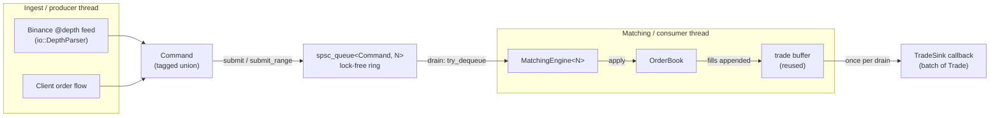
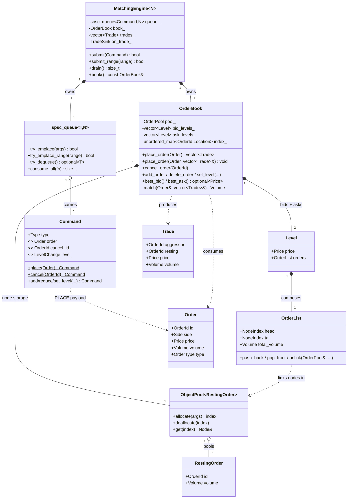

# order_book

A low-latency, price–time-priority limit **order book and matching engine** in
modern C++ (C++23), fronted by a lock-free single-producer/single-consumer
command queue. It can be driven two ways:

- **L1 / matching flow** — identified orders (`place`, `cancel`) that cross and
  generate trades, with per-order FIFO priority.
- **L2 / market-data flow** — absolute-size level updates fed from a Binance
  `@depth` diff stream, reconstructing a live book without per-order identity.

Everything on the hot path avoids allocation, virtual dispatch, and locks:
contiguous sorted level vectors, an intrusive object pool, branchless search,
and a bounded lock-free ring.

---

## Architecture at a glance



The queue is the seam between threads. The **producer** builds `Command`s and
hands them off (`submit`) — no trades exist yet. The **consumer** later `drain`s
the queue, applies each command to the `OrderBook`, and for `PLACE` runs the
matcher, appending fills into a reused buffer; at the end of the pass it fires
the trade sink once with that batch.

---

## Layers

| Layer | Files | Responsibility |
|---|---|---|
| **Transport** | `concurrent_queue/spsc_queue.hpp` | Bounded, lock-free, lossless SPSC ring. Absolute never-wrapped cursors distinguish full from empty; `memcpy` fast path for trivially-copyable elements. |
| **Command** | `engine/command.hpp` | Trivially-copyable tagged union describing one book mutation. Built via named factories so the active union member always matches the tag. |
| **Engine facade** | `engine/matching_engine.hpp` | Owns the queue + book + trade buffer + sink. `submit`/`submit_range` (producer), `drain` (consumer). Spawns no threads — the caller owns both. |
| **Matching core** | `engine/order_book.hpp/.cpp` | Price–time-priority book: sorted level vectors, id→location index, matching, resting, cancel. |
| **Storage types** | `engine/level.hpp`, `engine/order_list.hpp/.cpp`, `memory/object_pool.hpp` | `Level` = price + `OrderList`; `OrderList` = intrusive FIFO over an `ObjectPool<RestingOrder>`. |
| **Domain types** | `engine/order.hpp/.cpp`, `engine/trade.hpp`, `engine/types.hpp`, `engine/side.hpp` | `Order` (input), `Trade` (output), `Price/Volume/OrderId`, `Side`. |
| **Search** | `engine/branchless_binary_search.hpp` | `branchless_lower_bound` used to locate a price level. |
| **Market data / IO** | `io/binance_depth.hpp/.cpp` | Parse Binance REST snapshots and `depthUpdate` diffs (integer-scaled, no floating point) into `DepthSnapshot` / `DepthUpdate`. |
| **Tools** | `tools/` | `snapshot_tool`, `ws_capture_tool`. |

---

## Class model



Two nested containers, deliberately different:

- **Levels within a side** live in a `std::vector<Level>` kept sorted by price
  (bids descending, asks ascending) so the best price is always `front()` and a
  price is found in O(log n) via branchless binary search.
- **Orders within a level** live in an intrusive FIFO (`OrderList`) whose nodes
  sit in a shared `ObjectPool`. Links are pool **indices, not pointers**, so
  growing the pool never dangles them, and cancel is an O(1) splice.

`RestingOrder` is the normalized form of an `Order`: just `{id, volume}`. Side,
price, and time-in-force are implied by *where* it rests, so they're not stored
again.

---

## Order lifecycle (a crossing buy)

```mermaid
sequenceDiagram
    autonumber
    participant P as Producer thread
    participant Q as spsc_queue&lt;Command&gt;
    participant E as MatchingEngine (consumer)
    participant B as OrderBook
    participant S as TradeSink

    P->>Q: submit(Command::place(buy))
    Note over P: hands off and moves on;<br/>no trades yet
    E->>Q: drain() → try_dequeue()
    Q-->>E: Command(PLACE)
    E->>B: place_order(order, trades_)
    B->>B: match() vs opposite side (FIFO per level)
    B-->>E: fills appended to trades_ ; remainder rested
    E->>S: on_trade_(trades_)  (once for the batch)
```

`place_order(order)` returns a fresh `vector<Trade>`; the engine uses the
allocation-free overload `place_order(order, trades_)` so a whole drained batch
accumulates into one reused buffer.

---

## Core design decisions

- **Price–time priority.** Best price via sorted-vector `front()`; time priority
  via per-level FIFO. Matching sweeps opposite levels while they cross, filling
  oldest-first.
- **Object pool over `new`/`std::list`.** Pre-reserved contiguous slab, O(1)
  allocate/deallocate through a free list, index links. No malloc on the hot
  path, cache-dense traversal, deterministic latency. Fixed capacity — growth
  would reallocate and dangle handed-out references, so it's forbidden.
- **Lock-free SPSC transport.** Bounded, non-blocking, and *lossless* (a push on
  a full queue fails rather than overwriting). Cursors are cache-line separated;
  each side caches the other's cursor to avoid atomic loads on the common path.
- **Trivially-copyable `Command`.** Lets the queue take its batch `memcpy` path
  and keeps the payload branch-predictable.
- **Two disjoint book modes.** The identified `place`/`cancel` flow models
  per-order identity and FIFO; the L2 `set_level`/`add`/`delete` flow collapses a
  price to a single anonymous aggregate. They must not be mixed on one book.
- **No hidden threads.** `MatchingEngine` is caller-driven; you own the producer
  and consumer threads, matching the queue's SPSC contract and keeping it
  testable.

---

## Directory layout

```
src/
  engine/
    types.hpp            Price / Volume / OrderId
    side.hpp             Side (BID/ASK) + opposed()
    order.hpp/.cpp       Order (incoming request)
    trade.hpp            Trade (execution output)
    order_list.hpp/.cpp  RestingOrder, OrderPool, OrderList (intrusive FIFO)
    level.hpp/.cpp       Level (price + OrderList)
    order_book.hpp/.cpp  Matching engine core
    command.hpp          Command tagged union
    matching_engine.hpp  Queue + book facade
    branchless_binary_search.hpp
  memory/
    object_pool.hpp      ObjectPool<T> + Node<T>
  concurrent_queue/
    spsc_queue.hpp       Lock-free SPSC ring
    fast_queue.hpp
  io/
    binance_depth.hpp/.cpp   Binance depth snapshot / diff parsing
  tools/               snapshot_tool, ws_capture_tool
test/                  GoogleTest suites (incl. matching_engine_test.cpp)
benchmark/             Google Benchmark + queue comparisons
```

---

## Build

CMake + vcpkg, presets in `CMakePresets.json` (e.g. `windows-mingw`,
`windows-msvc`). Configurations: `Debug`, `Release`, `RelWithDebInfo`,
`AddressSanitizer`, `ThreadSanitizer`.

```sh
cmake --preset windows-mingw
cmake --build build/windows-mingw --config Release --target order_test
```
