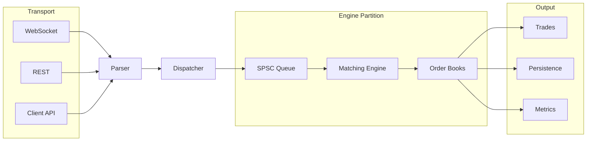

# Exchange Engine

<div align="center">

**A high-frequency trading framework in modern C++23.**


</div>

---

## Overview

The engine models the full execution pipeline: receiving market data and client
commands, routing them, matching, and emitting trades.

Determinism comes from ownership rather than locking — each order book is owned
exclusively by a single engine thread, and threads communicate only through
lock-free message passing. This keeps locks off the matching path while
preserving correctness.

The goal of this project is **software architecture**, not exchange
completeness; each subsystem is isolated and independently testable.

## Features

**Matching** — price priority across levels, then a per-book **allocation
policy** within one: price-time (FIFO per level) or pro-rata, which splits a
partial sweep by resting size and settles the rounding residual by time
priority. Limit orders, partial fills, multiple executions per incoming order,
cancellation, batched trade generation. Time-in-force is `GTC`, `IOC` and
`FOK`; `ALL_OR_NONE` is refused at admission rather than silently downgraded,
because honouring it needs a level to distinguish takeable depth from resting
depth ([TODO.md](TODO.md) #9). Iceberg / stop / market orders are planned.

**Queue position** — `queue_position_of` says where a resting order stands at
its price (lots and orders ahead, lots behind); `projected_fill` says what it
would receive from a sweep of a given size, computed with the matcher's own
arithmetic under whichever policy is in force. Passive alpha is a queue
question, so the book answers it rather than leaving strategies to guess.

**Depth and price impact** — `EXCHANGE::estimate_sweep` and
`l2_book::sweep_asks` / `sweep_bids` walk a side the way an aggressive order
would: how much of the size is really there, how many levels it reaches through,
where it leaves the touch, and what it pays. A book showing forty levels can
still be thin, and a touch price says nothing about either.

**Modelled latency** — `--latency-ns` costs a command time in flight before the
engine has it, on the live path and in a backtest alike, so runs measured under
different order-path costs are not silently compared. Only orders this process
sends are delayed; mirrored venue depth is not.

**Order book** — separate bid/ask books over sorted contiguous price levels,
pool-backed intrusive FIFO per level, O(1) cancel, O(log n) price lookup, no
heap allocation while matching once the node pool has warmed.

**Concurrency** — lock-free bounded SPSC queue, wait-free producer and consumer,
acquire/release ordering, cache-line-aligned control variables to avoid false
sharing.

**Market data** — Binance REST snapshots and WebSocket depth updates,
integer-scaled prices, L2 book reconstruction.

**Performance** — branchless binary search, cache-aware object pool, batch
command processing, zero-copy command transport, and run-time-dispatched SIMD
for the reads that walk a whole side of a book (1.7x-2.9x at 128 levels; one
binary picks SSE4, AVX2, AVX-512 or NEON on the host it starts on).

## Performance targets

| Path | Target | Budget per item |
|------|--------|-----------------|
| Market data ingestion | 10M msg/s | 100 ns |
| Order book updates | 1M updates/s | 1 µs |
| Order processing | 100K orders/s | 10 µs |

Sustained steady-state on one machine. Ingestion is an aggregate across sharded
ingest cores — JSON decode alone exceeds the per-message budget on a single
core. See [docs/performance.md](docs/performance.md) for the budget derivation,
the current gaps against it, and how each target is measured.

## Architecture


```mermaid
flowchart LR
    subgraph Transport["Transport"]
        WS["WebSocket"]
        REST["REST"]
        CLIENT["Client API"]
    end
    PARSER["Parser"]
    ROUTER["Dispatcher"]
    subgraph Engine["Engine Partition"]
        Q["SPSC Queue"] --> ME["Matching Engine"] --> OB["Order Books"]
    end
    subgraph Output["Output"]
        TRADES["Trades"]
        JOURNAL["Persistence"]
        METRICS["Metrics"]
    end
    WS & REST & CLIENT --> PARSER --> ROUTER --> Q
    OB --> TRADES & JOURNAL & METRICS
```

Commands flow through fixed layers, each depending only on its neighbor. Only
the execution layer mutates market state. See
[docs/architecture.md](docs/architecture.md) for the execution model and
[docs/directory_layout.md](docs/directory_layout.md) for the source tree.

The same layers run offline against a recorded feed —
`exchange_tool backtest capture.jsonl --snapshot depth.json` — so a strategy can
be measured against real market data through the real matcher. What that models
and what it does not is [docs/backtesting.md](docs/backtesting.md).

What it has actually measured is [docs/findings.md](docs/findings.md): on a
tick-locked SOLUSDT book, quoting at the touch captured 0.0013% of the volume
that printed at our own price, and the fills we did get marked out negative at
every horizon - -1.5 ticks at 10ms falling to -2.5 at 5s. Adverse selection,
measured rather than assumed.

And they run **live**: `exchange_tool serve SOLUSDT --tick 0.01` drives a
venue's diff-depth stream through the depth bridge, a strategy through the
pre-trade gate, a matching engine on its own thread, and the published trades
and outcomes back to the gate, the strategy and the post-trade monitor — with
the feed watchdog and the circuit breaker live throughout. It sends nothing to
the venue: the depth is seeded into this process's own book and the strategy
trades against it there. See [docs/deployment.md](docs/deployment.md) for the
option surface and what it publishes to watch.

## Build

CMake presets drive everything, and `VCPKG_ROOT` must be set. In-source builds
are refused. Every preset uses a multi-config generator, so on Windows the
binaries land in `build/<configure-preset>/bin/<Config>/`.

```sh
cmake --preset windows-mingw                   # configure
cmake --build --preset windows-mingw-debug     # build
ctest --preset windows-mingw-debug             # test
cmake --workflow --preset windows-mingw-debug  # all three
```

A configure preset is `<toolchain>[-<purpose>]`. The toolchains are
`windows-mingw`, `windows-msvc`, `macos-arm64-appleclang`, `macos-arm64-llvm`,
`linux-gcc` and `linux-clang`. The purposes narrow what the tree can do:
*(none)* is the daily driver (unity batching, ccache, IPO), `-safety` turns on
hardening and trapping UBSan, `-coverage` instruments, `-analysis` runs
clang-tidy and cppcheck, and `-asan` / `-tsan` / `-ubsan` / `-lsan` / `-msan` /
`-hwasan` each register exactly one sanitizer family.

**A sanitizer preset exists only where that sanitizer actually instruments** —
there is no TSan on Windows at all, and no ASan under MinGW. The lock-free work
in `core/concurrency/` is therefore checked on the macOS and Linux runners in
[.github/workflows/ci.yml](.github/workflows/ci.yml). Run at least one sanitizer
preset before calling concurrency or memory work done.

Three targets: `order_test` (the whole suite, one binary), `order_bench`
(Google Benchmark) and `exchange_tool` (the CLI).

```sh
build/windows-mingw/bin/Debug/order_test --gtest_filter=OrderBook.*
build/windows-mingw/bin/Release/order_bench --benchmark_filter=BM_MatchingEngine
```

Preset definitions live in [cmake/presets/](cmake/presets/), one file per
toolchain; project options are `EXCHANGE_*` in
[cmake/ProjectOptions.cmake](cmake/ProjectOptions.cmake).

## Roadmap

- **Exchange** — engine partitioning, NUMA scheduling, symbol routing
- **Matching** — iceberg, stop, market, IOC/FOK
- **Infrastructure** — FIX gateway, persistence, replay, event sourcing
- **Performance** — intrusive order list, allocation-free ingest, ingest
  sharding, SIMD, huge pages, lock-free dispatcher
  ([targets](docs/performance.md))
- **Analytics** — latency profiler, metrics, benchmark suite
