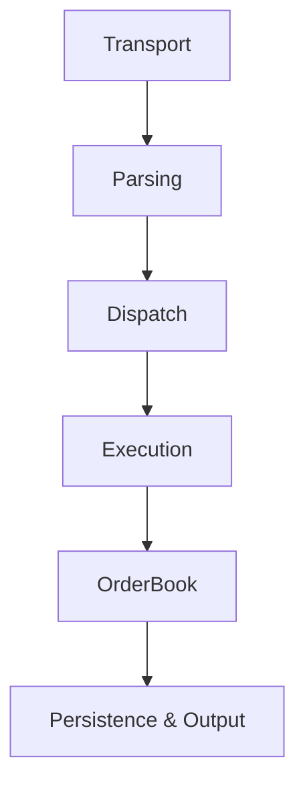
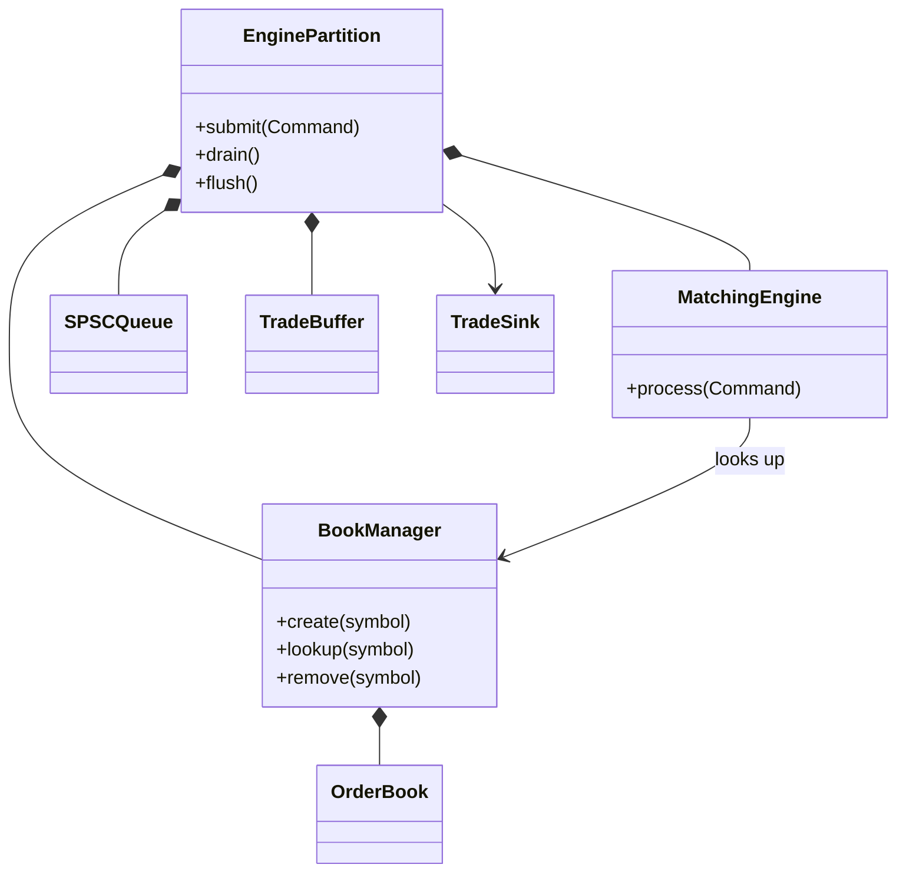
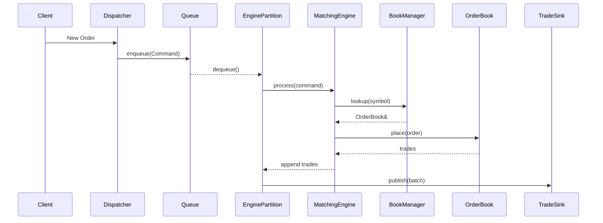

# Architecture

How the engine's components cooperate to process orders and market data with
deterministic, low-latency execution. For the high-level pitch see the
[README](../README.md); for the source tree see
[directory_layout.md](directory_layout.md).

## Principles

- **Single ownership** — every mutable object has exactly one owner. An
  `OrderBook` is never shared; it belongs to one engine partition. Ownership
  replaces synchronisation.
- **Event driven** — external inputs (client orders, market data, admin,
  recovery) become internal commands delivered asynchronously. The engine never
  polls.
- **Deterministic** — an identical command stream always yields identical market
  state and trades, which makes testing, replay, and persistence tractable.
- **Layered** — each subsystem has one responsibility and depends only on the
  layer below it.

## Pipeline

Every request flows through fixed layers; only the execution layer mutates
market state.

| Layer | Responsibility |
|-------|----------------|
| Transport | Receive bytes from WebSocket / REST / FIX / replay. Knows protocols, not matching rules. |
| Parsing | Decode protocol messages into uniform internal commands. |
| Dispatch | Route each command to the partition owning its symbol (`hash(symbol) % partitions`). Owns no state. |
| Execution | Run commands sequentially inside an engine partition. |
| Order Book | Maintain bid/ask state, price-time priority, matching, resting liquidity. No synchronisation primitives. |
| Output | Publish trades, journals, snapshots, metrics. Observes results, never mutates state. |

## Engine partition

An engine partition is the unit of execution. It owns all mutable state for a
subset of instruments and is serviced by exactly one consumer thread, so the
matching path is contention-free and synchronisation is confined to the queue.

A partition owns a command queue, a matching engine, a book manager, reusable
trade buffers, and a trade sink. The two roles are deliberately split: the
**matching engine's** sole responsibility is executing commands, while the
**book manager** creates, owns, looks up, and removes the `OrderBook`
instances. The engine operates on a book it looks up through the manager rather
than owning any book itself. A partition does **not** touch the network, parse
protocols, route symbols, or share state with other partitions.

## Command lifecycle

The producer never touches the `OrderBook` — ownership is transferred by passing
commands one-way through the lock-free queue.

## Matching stages

Each incoming order runs through deterministic stages:

1. **Validate** — structural checks (positive quantity/price, known id).
2. **Locate** — branchless binary search over sorted contiguous levels, `O(log n)`.
3. **Match** — cross against the opposite side, best price first across levels, FIFO within a level.
4. **Rest** — any remaining quantity becomes resting liquidity.
5. **Emit** — trades append to a reusable buffer; the sink is invoked once per
   batch to minimize callback overhead.

Command types today: `PlaceOrder`, `CancelOrder`, `ModifyOrder`,
`MarketDataUpdate`. Planned: replace, halt/resume, snapshot, admin.

## Why exclusive ownership

Rather than making one order book concurrent across threads, the engine
partitions ownership so each book has a single writer. This removes mutexes,
atomics, hazard pointers, and lock-free trees from the matching path, and buys
determinism and cache locality. Concurrency lives entirely in message passing.
