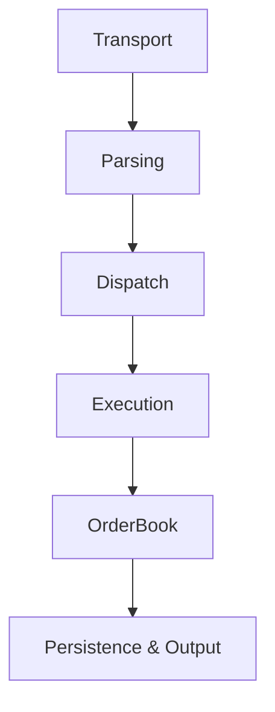
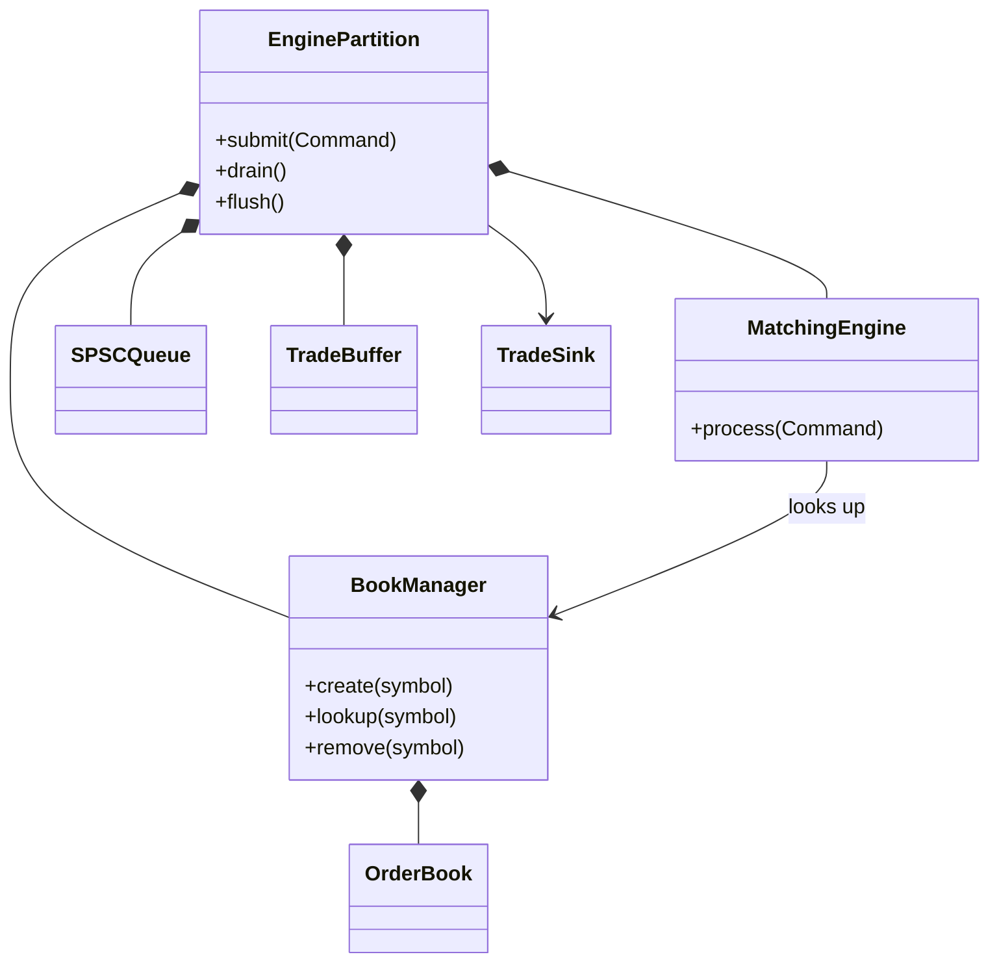
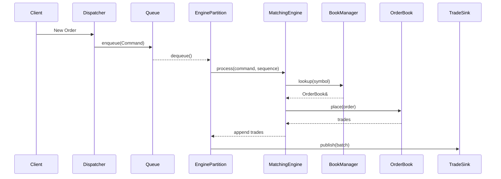

# Architecture

How the engine's components cooperate to process orders and market data with
deterministic, low-latency execution. For the high-level pitch see the
[README](../README.md); for the source tree see
[directory_layout.md](directory_layout.md); for the throughput each layer must
sustain see [performance.md](performance.md).

## Principles

- **Single ownership** — every mutable object has exactly one owner. An
  `OrderBook` is never shared; it belongs to one engine partition. Ownership
  replaces synchronisation.
- **Event driven** — external inputs (client orders, market data, admin,
  recovery) become internal commands delivered asynchronously. The engine never
  polls.
- **Deterministic** — an identical command stream always yields identical market
  state and trades, which makes testing, replay, and persistence tractable.
- **Layered** — each subsystem has one responsibility and depends only on the
  layer below it.

## Pipeline

Every request flows through fixed layers; only the execution layer mutates
market state.


```mermaid
flowchart TD
    Transport --> Parsing --> Dispatch --> Execution --> OrderBook --> Output["Persistence & Output"]
```

| Layer | Responsibility |
|-------|----------------|
| Transport | Receive bytes from WebSocket / REST / FIX / replay. Knows protocols, not matching rules. |
| Parsing | Decode protocol messages into uniform internal commands. |
| Dispatch | Route each command to the partition owning its symbol (`hash(symbol) % partitions`). Owns no state. |
| Execution | Run commands sequentially inside an engine partition. |
| Order Book | Maintain bid/ask state, price priority and the level's allocation policy, matching, resting liquidity, queue position. No synchronisation primitives. |
| Output | Publish trades, journals, snapshots, metrics. Observes results, never mutates state. |

## Throughput budget

Each layer owns a share of the engine's targets:

| Layer | Target | Budget per item |
|-------|--------|-----------------|
| Transport + Parsing | 10M msg/s (aggregate) | 100 ns |
| Order Book | 1M updates/s | 1 µs |
| Dispatch + Execution | 100K orders/s | 10 µs |

Two consequences shape the design above. First, 100 ns per message is under a
single JSON decode, so ingestion must be **sharded by symbol across cores** —
the target is aggregate, never per-core, and the dispatcher is what makes it
reachable. Second, none of the three budgets covers an allocation, so the
ingest and matching paths must reach steady state with no heap traffic at all:
pools, arenas, and inline storage only.

See [performance.md](performance.md) for the derivation, the current gap
against each budget, and the measurement rules.

## Engine partition

An engine partition is the unit of execution. It owns all mutable state for a
subset of instruments and is serviced by exactly one consumer thread, so the
matching path is contention-free and synchronisation is confined to the queue.


```mermaid
classDiagram
    class EnginePartition {
        +submit(Command)
        +drain()
        +flush()
    }
    class MatchingEngine {
        +process(Command)
    }
    class BookManager {
        +create(symbol)
        +lookup(symbol)
        +remove(symbol)
    }
    EnginePartition *-- SPSCQueue
    EnginePartition *-- MatchingEngine
    EnginePartition *-- BookManager
    EnginePartition *-- TradeBuffer
    EnginePartition --> TradeSink
    BookManager *-- OrderBook
    MatchingEngine --> BookManager : looks up
```

A partition owns a command queue, a matching engine, a book manager, reusable
trade buffers, and a trade sink. The two roles are deliberately split: the
**matching engine's** sole responsibility is executing commands, while the
**book manager** creates, owns, looks up, and removes the `OrderBook`
instances. The engine operates on a book it looks up through the manager rather
than owning any book itself. A partition does **not** touch the network, parse
protocols, route symbols, or share state with other partitions.

## Command lifecycle

The producer never touches the `OrderBook` — ownership is transferred by passing
commands one-way through the lock-free queue.


```mermaid
sequenceDiagram
    participant Client
    participant Dispatcher
    participant Queue
    participant Partition as EnginePartition
    participant Matcher as MatchingEngine
    participant Books as BookManager
    participant Book as OrderBook
    participant Sink as TradeSink
    Client->>Dispatcher: New Order
    Dispatcher->>Queue: enqueue(Command)
    Queue-->>Partition: dequeue()
    Partition->>Matcher: process(command, sequence)
    Matcher->>Books: lookup(symbol)
    Books-->>Matcher: OrderBook&
    Matcher->>Book: place(order)
    Book-->>Matcher: trades
    Matcher-->>Partition: append trades
    Partition->>Sink: publish(batch)
```

## Matching stages

Each incoming order runs through deterministic stages:

1. **Validate** — structural checks (positive quantity/price, known id).
2. **Locate** — branchless binary search over sorted contiguous levels, `O(log n)`.
3. **Match** — cross against the opposite side, best price first across levels, then by the book's allocation policy within a level (see below).
4. **Rest** — any remaining quantity becomes resting liquidity.
5. **Emit** — trades append to a reusable buffer; the sink is invoked once per
   batch to minimize callback overhead.

Command types today are the five in
[`event::command`](../src/event/command.hpp): `PLACE` (cross, then rest the
remainder), `CANCEL` (remove a resting order by id), `MODIFY` (amend a resting
order's price or quantity), `ADD` (rest anonymous liquidity, no matching) and
`REDUCE` (drain quantity at a price, FIFO-first). `ADD` and `REDUCE` carry no
order identity and produce no outcome — they are how a venue's L2 depth is
seeded into a book, not client order flow.

Planned: halt/resume, snapshot and admin.

> Earlier revisions of this document listed `ModifyOrder` and
> `MarketDataUpdate` as existing when neither did. `MODIFY` landed for real in
> [TODO.md](../TODO.md) #3; `MarketDataUpdate` still does not exist and is not
> planned, because depth arrives as `ADD` / `REDUCE`.

### What an amendment costs

`MODIFY` is the only command whose interesting content is a *priority* decision
rather than a quantity, so the rules are worth stating where they can be found.
[`order_book::modify_order`](../src/order_book/order_book.hpp) applies them:

| The amendment | What the book does | Priority |
| --- | --- | --- |
| same price, quantity down | resizes the node where it stands | kept |
| same price, quantity up | moves the node to the back of its level | lost |
| price changes | removes, re-crosses, re-rests at the new price | lost |
| down to at or below traded | withdraws it — reported as `CANCELLED` | n/a |

An increase loses priority because time priority is a claim about when *lots*
arrived, not when an order did: lots added by an amendment arrived now, and a
venue that let them keep an older queue position would let a one-lot order
placed at the open be amended to a thousand at the touch. A decrease raises no
such question — the remaining lots are the same lots, and they have been
queueing since the order was placed.

A price change re-crosses because the order is priced where it was not before
and the opposite side may already be sitting there; moving it onto a crossing
price *without* matching would leave the book crossed. The old node is removed
before any of that, because the remainder rests under the same id and the
id→location index holds one entry per order.

An amendment carries no side and no time-in-force, and neither is an omission:
a resting order carries no time-in-force either (`detail::resting_order` is an
id and an `order_state`), so every resting order is `GOOD_TILL_CANCELLED` as far
as matching is concerned and there is nothing there to amend. Changing side
would be a different order.

The `amendment` payload cost the journal nothing — an order id, a price, a
quantity and a receipt time each already had an offset in
[`journal_record`](../src/event/journal_record.hpp)'s layout, so a journal
written before the command existed still reads back unchanged.

## Sequencing and identity

A record that leaves the engine has to say which command it came from and, if it
reports an execution, which execution. Three numbers do that, and each is
assigned in exactly one place.

| | Assigned by | Scope | Zero means |
|---|---|---|---|
| `trade::sequence`, `order_outcome::sequence` | `EnginePartition::drain`, counting commands as it applies them | one partition | not from an engine |
| `trade::id` | `OrderBook`, where the execution is created | one listing | not printed by a book |
| `trade::timestamp` | the gateway, onto `order::timestamp`; carried through | — | not stamped |

The engine sequence is a command's **ordinal in the applied stream**, not a
number a producer chose. That is what makes it equal to the command's index in
that partition's journal, and it is why replay is verifiable: replaying a
journal re-derives the same numbers, so the recovered stream compares to the
original record for record. A producer-assigned sequence could disagree with the
log, and a gap or a repeat would then be indistinguishable from a command that
never arrived. It is dense for the same reason — a misroute and a depth command
take a number even though one is answered with a rejection and the other is
answered to nobody, because both are in the journal.

Sequences are per partition and mean nothing across two. A venue-wide total
order would be a synchronisation point on the one path that deliberately has
none; partitions own disjoint listings, so nothing downstream needs it.

`trade::id` is per listing, because a tape is per listing: a consumer of one
instrument wants its prints numbered 1, 2, 3 and can then tell a gap from a
message it dropped. `(symbol_id, trade_id)` is the venue-unique name, and
[`event::engine_event`](../src/event/engine_event.hpp) reattaches the symbol on
the way out.

`trade::timestamp` is the **aggressor's receipt time**, not the moment of the
match. Reading a clock per execution would cost tens of nanoseconds on a path
budgeted in nanoseconds, and — decisively — it would make every replayed trade
differ from the one it is reproducing. Receipt time is in the journal, so it
replays exactly. Matching latency is `partition_metrics::drain_latency_ns`
instead, which is the thing that number was actually measuring.

### One trade, two lifecycle records

A venue owes each side of an execution its own report. Emporia gives it as a
fill per side (`publishFills`); this does not, because the `trade` already
carries everything such a pair would duplicate — the taker is `aggressor` on
`aggressor_side`, the maker is `resting` on the other side, and both executed
the same `price` and `volume`. What differs between the sides is each order's
*own* remaining quantity, which is not a property of the execution at all: it
comes off the two `FILL` outcomes the matching loop already emits, and
`order_outcome::trade_id` joins them to the print. A partition publishes trades
before outcomes in the same batch, so the join never spans a flush.

## Allocation within a level

Price priority is absolute: the matching loop walks the opposite ladder from
`best()` and never reaches a worse price while a better one has quantity. What a
venue chooses is the tie-break *between orders resting at the same price*, and
`EXCHANGE` takes it as a construction parameter
([`allocation_policy`](../src/order_book/allocation_policy.hpp)), fixed for the
book's life the way a listing's matching algorithm is fixed for a session.

| | `PRICE_TIME` (default) | `PRO_RATA` |
|---|---|---|
| Partial sweep | goes to the head of the FIFO, in full, then the next order | split across every order in proportion to what it has resting |
| Rewards | arriving early | resting size |
| Rounding | none — allocations are whole orders | shares floored, then one lot apiece down the FIFO until the residual is spent |
| Used by | equities, most crypto | short-end rates futures (CME SOFR), where a front-month FIFO queue is unwinnable |

A sweep that takes the **whole** level behaves identically under both: every
resting order fills and there is nothing to divide, so the matcher takes the
cheaper FIFO path either way. Allocation is only ever a question about a partial
sweep.

Pro-rata's residual pass is what keeps time priority meaningful under it.
Flooring each share loses less than a lot per order, so the residual is strictly
smaller than the number of orders at the price, and handing it out one lot apiece
in arrival order both exhausts it exactly and never allocates an order more than
it has resting. Dumping the whole residual on the head instead would be a second,
hidden FIFO allocation — large enough to matter on a level of many small orders.
CME's optional *top-order allocation* and minimum allocations above one lot are
deliberately not modelled: they are per-contract parameters rather than
properties of pro-rata, so they belong on `symbol_spec` if they are ever wanted.

## Queue position

Under price-time, whether a resting order fills is a question about the queue in
front of it, not about the market — so the book answers it directly rather than
leaving each strategy to reconstruct it from depth:

- `queue_position_of(id)` — the price and side, our own remaining quantity, the
  lots and order count ahead of us, the lots behind, and the policy in force.
- `projected_fill(id, incoming)` — the lots that order would receive if an
  aggressor of `incoming` lots, priced through its level, arrived now. Better
  levels on our side are paid for first, and what is left is divided at our price
  by the same code the matching loop runs, so a strategy's model of the venue *is*
  the venue.

Neither is on the matching path: both walk a level's FIFO, which is O(orders at
the price), and nothing per-order is cached to make them cheaper — a stored rank
would have to be rewritten behind every cancel, charging the matching path for a
number only a reader wants.

The offline counterpart is
[`strategy::backtest::queue_position_book`](../src/strategy/backtest/queue_position.hpp),
which *estimates* the same quantity from a venue's aggregate depth feed, because
a replay has no order identities to count. The two are not interchangeable: this
one is exact and about books this process owns.

## Depth, and what a large order would cost

The aggressive side of the same walk. `volume_at_price` and a touch cannot answer
"what happens if I have to take 500 lots now", and neither can a level count — a
book showing forty levels can still be thin. Both books therefore answer it
directly:

| | `engine::EXCHANGE::estimate_sweep` | `market_data::l2_book::sweep_asks` / `sweep_bids` |
|---|---|---|
| Over | the book this process matches in | the depth the venue publishes |
| Units | ticks and lots | the feed's scaled decimals |
| Reports | filled vs requested, levels consumed, touch → last, `impact()`, `notional`, `slippage()` | the same, without a notional |

Four numbers rather than an average price, because a taker's problems fail
independently: the size may not be there, it may be there only at prices that
make the trade pointless, and getting it moves the touch other participants are
reading. An average hides the first and the third.

The asymmetry over the notional is the unit systems being honest. In tick space
`Σ price × qty` cannot overflow `volume_t` for any book that fits in memory. In
market_data's scaled space both factors are scaled decimals — at scale 8 a
five-figure price is ~10^12 — so the product reaches ~10^20 and a 64-bit
accumulator wraps. Wrapping silently on a deep book is the failure this codebase
refuses elsewhere, and there is no 128-bit integer on every toolchain here, so
the l2 sweep reports what it can state exactly and leaves the cost to a caller
that knows its own scales.

Neither models the allocation policy, and neither needs to: a sweep either clears
a level or is the last thing to happen to it, so the lots and the prices are the
same whoever they are divided between. Which *orders* fill is pro-rata's business;
what the taker pays is not.

## Modelled latency

`--latency-ns` costs a command time in flight before the engine has it, and it
means the same thing on both paths — which is the point, since a number measured
under a modelled microsecond is not comparable with one measured under an
instantaneous order path.

```text
strategy ─▶ risk gate ─▶ [ wire ] ─▶ fill model ─▶ partition
                            │
        offline: the settle loop delivers, because it advanced market time itself
        live:    a steady timer delivers, armed from next_due_ns()
```

[`backtest::wire`](../src/strategy/backtest/wire.hpp) is the model and is
clock-agnostic; [`session::latency_pipe`](../src/session/latency_pipe.hpp) is what
gives it a driver on the live path. Only PLACE and CANCEL are delayed — ADD and
REDUCE mirror depth the venue already has, and delaying those would make the
engine's book lag a market its own strategy can see. Configure no latency and no
wire is built at all, so the default chain is unchanged.

Two limits are worth stating rather than discovering. Delivery cannot beat the
platform's timer resolution, about a millisecond on Windows, so a modelled 50 µs
is late and jittered live where a backtest — which owns its clock — is exact. And
a full wire is back-pressure that only time relieves: the retry in
`live_session::quote` delivers as it waits, because a loop that only pumped would
deadlock against the timer it was waiting for.

## Why exclusive ownership

Rather than making one order book concurrent across threads, the engine
partitions ownership so each book has a single writer. This removes mutexes,
atomics, hazard pointers, and lock-free trees from the matching path, and buys
determinism and cache locality_hint. Concurrency lives entirely in message passing.
